# Лабораторная работа №1. Работа с сокетами

## Цель работы

Понять принципы межсокетного взаимодейсвтия в вебе. Научиться реализовывать базовую архитектуру клиент-сервер.

## Задание 1. Обмен сообщениями по UDP

### Описание

Были реализованы серверная и клиентская части приложения с использованием UDP. Клиент отправляет серверу сообщение `Hello, server`, после чего сервер отвечает сообщением `Hello, client`.

При создании сокета используется параметр `socket.SOCK_DGRAM`, соответствующий протоколу UDP. Сервер получает сообщение методом `recvfrom()` вместе с адресом отправителя, а ответ отправляет методом `sendto()`.

### Код программы

??? info "Код сервера"
    ```python
    import socket

    server_socket = socket.socket(socket.AF_INET, socket.SOCK_DGRAM)
    server_socket.bind(("localhost", 8080))

    print("Сервер запущен...")

    while True:
        message, client_address = server_socket.recvfrom(1024)
        print("Сообщение от клиента:", message.decode())

        server_socket.sendto(
            "Hello, client".encode(),
            client_address
        )
    ```

??? info "Код клиента"
    ```python
    import socket

    client_socket = socket.socket(socket.AF_INET, socket.SOCK_DGRAM)

    client_socket.sendto(
        "Hello, server".encode(),
        ("localhost", 8080)
    )

    message, server_address = client_socket.recvfrom(1024)
    print("Сообщение от сервера:", message.decode())

    client_socket.close()
    ```

### Пример работы

Сначала был запущен сервер, затем в другом терминале - клиент.

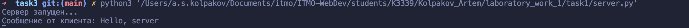


**Результат:** обмен сообщениями по протоколу UDP выполнен успешно.

---

## Задание 2. Вычисления через TCP

### Описание

Порядковый номер в журнале — 16, поэтому был выбран вариант 4: вычисление площади параллелограмма.

Клиент считывает значения с клавиатуры и передаёт их серверу. Сервер выполняет вычисление и возвращает результат клиенту. Для передачи данных используется TCP-сокет `socket.SOCK_STREAM`.

### Код программы

??? info "Код сервера"
    ```python
    import socket

    server_socket = socket.socket(socket.AF_INET, socket.SOCK_STREAM)
    server_socket.bind(("localhost", 8080))
    server_socket.listen(1)

    print("Сервер запущен...")

    while True:
        client_connection, client_address = server_socket.accept()
        print("Подключился клиент:", client_address)

        data = client_connection.recv(1024).decode()
        a, h = map(float, data.split())

        area = a * h

        client_connection.sendall(str(area).encode())
        client_connection.close()
    ```

??? info "Код клиента"
    ```python
    import socket

    a = float(input("Введите длину основания: "))
    h = float(input("Введите высоту: "))

    client_socket = socket.socket(socket.AF_INET, socket.SOCK_STREAM)
    client_socket.connect(("localhost", 8080))

    data = f"{a} {h}"
    client_socket.sendall(data.encode())

    result = client_socket.recv(1024).decode()
    print("Площадь параллелограмма:", result)

    client_socket.close()
    ```

### Пример работы

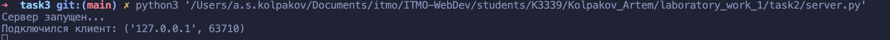
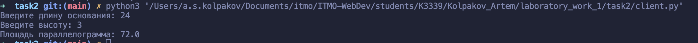


**Результат:** параметры были переданы серверу по TCP, вычисление выполнено на сервере, а результат возвращён клиенту.

---

## Задание 3. Раздача HTML-страницы по HTTP

### Описание

Был реализован HTTP-сервер, который принимает запрос браузера, загружает HTML-страницу из файла `index.html` и отправляет её в теле HTTP-ответа.

Ответ содержит:

| Элемент | Значение |
|---------|----------|
| Строка состояния | `HTTP/1.1 200 OK` |
| Тип содержимого | `text/html; charset=UTF-8` |
| Длина содержимого | Количество байтов в HTML-странице |
| Режим соединения | `Connection: close` |

### Код программы

??? info "Код сервера"
    ```python
    import socket

    HOST = "localhost"
    PORT = 8080

    server_socket = socket.socket(socket.AF_INET, socket.SOCK_STREAM)
    server_socket.bind((HOST, PORT))
    server_socket.listen(5)

    print(f"HTTP-сервер запущен на {HOST}:{PORT}")

    while True:
        client_connection, client_address = server_socket.accept()
        print("Подключение от:", client_address)

        request = client_connection.recv(1024).decode()
        print("Запрос клиента:\n", request)

        with open("./index.html", "r", encoding="utf-8") as file:
            html_content = file.read()

        http_response = (
            "HTTP/1.1 200 OK\r\n"
            "Content-Type: text/html; charset=UTF-8\r\n"
            f"Content-Length: {len(html_content.encode('utf-8'))}\r\n"
            "Connection: close\r\n"
            "\r\n"
            + html_content
        )

        client_connection.sendall(http_response.encode("utf-8"))
        client_connection.close()
    ```

??? info "Код HTML страницы"
    ```html
    <!DOCTYPE html>
    <html lang="en">
    <head>
      <meta charset="UTF-8">
      <meta name="viewport" content="width=device-width, initial-scale=1.0">
      <title>лаб1</title>
    </head>
    <body>
      <h1>прив)</h1>
    </body>
    </html>
    ```

### Пример работы

Сервер был запущен в терминале, после чего в браузере был открыт адрес `http://localhost:8080`.

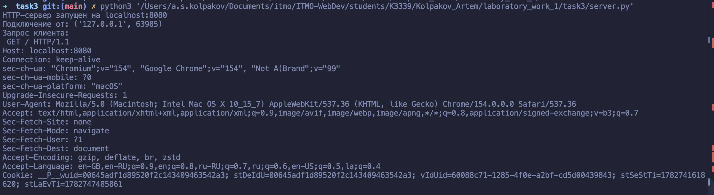
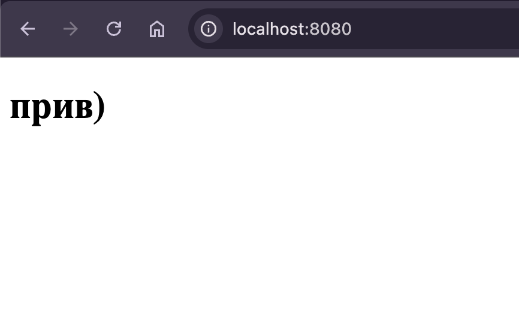

!!! note "Длина ответа"
    Значение `Content-Length` вычисляется после кодирования HTML в UTF-8, поэтому в заголовке указывается количество байтов, а не символов.

**Результат:** браузер получил корректный HTTP-ответ и отобразил страницу из файла `index.html`.

---

## Задание 4. Многопользовательский чат

### Описание

Был реализован многопользовательский чат с использованием TCP и библиотеки `threading`. Используется один клиентский файл, который каждый пользователь запускает в отдельном терминале.

При подключении пользователь вводит имя. Сервер хранит соответствие между сокетом клиента и его именем в словаре `clients`. Для каждого подключения создаётся отдельный поток. Полученные сообщения сервер рассылает всем пользователям, кроме отправителя. Для выхода используется команда `/exit`.

### Код программы

??? info "Код сервера"
    ```python
    import socket
    import threading

    HOST = "localhost"
    PORT = 8080

    clients = {}

    def send_to_all(message, sender=None):
        for client in list(clients):
            if client != sender:
                client.sendall(message.encode())

    def handle_client(client):
        username = client.recv(1024).decode()
        clients[client] = username

        print(f"{username} подключился")
        send_to_all(f"{username} вошёл в чат", client)

        while True:
            message = client.recv(1024).decode()

            if not message or message == "/exit":
                break

            full_message = f"{username}: {message}"
            print(full_message)
            send_to_all(full_message, client)

        del clients[client]
        client.close()

        print(f"{username} отключился")
        send_to_all(f"{username} вышел из чата")

    server_socket = socket.socket(socket.AF_INET, socket.SOCK_STREAM)
    server_socket.bind((HOST, PORT))
    server_socket.listen(5)

    print(f"Сервер запущен на {HOST}:{PORT}")

    while True:
        client_connection, client_address = server_socket.accept()
        print("Подключение от:", client_address)

        thread = threading.Thread(
            target=handle_client,
            args=(client_connection,)
        )
        thread.start()
    ```

??? info "Код клиента"
    ```python
    import socket
    import threading

    HOST = "localhost"
    PORT = 8080

    username = input("Введите имя: ")

    client_socket = socket.socket(socket.AF_INET, socket.SOCK_STREAM)
    client_socket.connect((HOST, PORT))
    client_socket.sendall(username.encode())

    def receive_messages():
        while True:
            try:
                message = client_socket.recv(1024).decode()

                if not message:
                    break

                print(message)
            except:
                break

    thread = threading.Thread(target=receive_messages)
    thread.daemon = True
    thread.start()

    print("Вы подключились к чату")
    print("Для выхода введите /exit")

    while True:
        message = input()

        client_socket.sendall(message.encode())

        if message == "/exit":
            break

    client_socket.close()
    ```

### Пример работы

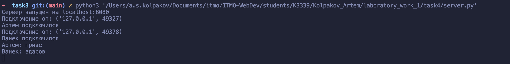
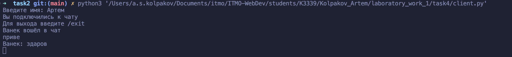
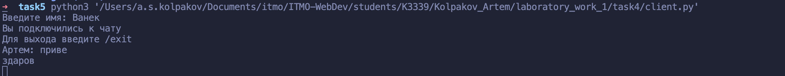

**Результат:** сервер одновременно обслуживает нескольких пользователей, идентифицирует их по имени и рассылает сообщения между подключёнными клиентами.

---

## Задание 5. Простой веб-сервер с GET и POST

### Описание

Был реализован веб-сервер для ведения журнала оценок. HTML-форма отправляет на сервер название дисциплины и оценку методом POST. Метод GET используется для получения HTML-страницы с формой и текущим содержимым журнала.

| Метод | Описание |
|-------|----------|
| GET |  Получить страницу с журналом оценок |
| POST |  Добавить оценку по выбранной дисциплине |

Оценки хранятся в словаре, где название дисциплины является ключом, а список оценок — значением:

```python
{
    "Математика": ["5", "4"],
    "Физика": ["3"]
}
```

HTML-разметка хранится в отдельном файле. Сервер формирует список оценок и подставляет его вместо метки `{{GRADE_LIST}}`.

### Код программы

??? info "Код сервера"
    ```python
    import socket
    import os
    from urllib.parse import parse_qs

    HOST = "localhost"
    PORT = 8080

    grades = {}

    def create_page():
        grade_list = ""

        for subject, subject_grades in grades.items():
            grade_list += (
                f"<li><b>{subject}</b>: {', '.join(subject_grades)}</li>"
            )

        if not grade_list:
            grade_list = "<li>Оценок пока нет</li>"

        file_path = os.path.join(
            os.path.dirname(__file__),
            "index.html"
        )

        with open(file_path, "r", encoding="utf-8") as file:
            html_template = file.read()

        return html_template.replace(
            "{{GRADE_LIST}}",
            grade_list
        )


    server_socket = socket.socket(socket.AF_INET, socket.SOCK_STREAM)
    server_socket.bind((HOST, PORT))
    server_socket.listen(5)

    print(f"Сервер запущен на http://{HOST}:{PORT}")

    while True:
        client_connection, client_address = server_socket.accept()

        request = b""

        while b"\r\n\r\n" not in request:
            request += client_connection.recv(1024)

        headers_data, body = request.split(b"\r\n\r\n", 1)
        headers_text = headers_data.decode("utf-8")

        lines = headers_text.split("\r\n")
        method, path, protocol = lines[0].split()

        headers = {}

        for line in lines[1:]:
            if ": " in line:
                name, value = line.split(": ", 1)
                headers[name.lower()] = value

        content_length = int(headers.get("content-length", 0))

        while len(body) < content_length:
            body += client_connection.recv(1024)

        if method == "POST":
            form_data = parse_qs(body.decode("utf-8"))

            subject = form_data.get("subject", [""])[0]
            grade = form_data.get("grade", [""])[0]

            if subject and grade:
                if subject not in grades:
                    grades[subject] = []

                grades[subject].append(grade)

                print(f"Добавлена оценка: {subject} - {grade}")

        html_content = create_page()
        html_bytes = html_content.encode("utf-8")

        http_response = (
            "HTTP/1.1 200 OK\r\n"
            "Content-Type: text/html; charset=UTF-8\r\n"
            f"Content-Length: {len(html_bytes)}\r\n"
            "Connection: close\r\n"
            "\r\n"
        ).encode("utf-8")

        client_connection.sendall(http_response + html_bytes)
        client_connection.close()
    ```

??? info "HTML-шаблон"
    ```html
    <!DOCTYPE html>
    <html lang="en">
    <head>
        <meta charset="UTF-8">
        <title>Журнал оценок</title>

        <style>
            body {
                font-family: Arial, sans-serif;
                max-width: 600px;
                margin: 40px auto;
            }

            form {
                display: flex;
                gap: 10px;
            }

            input, button {
                padding: 8px;
            }
        </style>
    </head>
    <body>
        <h1>Журнал оценок</h1>

        <form method="POST" action="/">
            <input
                type="text"
                name="subject"
                placeholder="Название дисциплины"
                required
            >
            <input
                type="number"
                name="grade"
                placeholder="Оценка"
                required
            >
            <button type="submit">Добавить</button>
        </form>

        <h2>Все оценки</h2>

        <ul>
            {{GRADE_LIST}}
        </ul>
    </body>
    </html>
    ```

### Обработка HTTP-запроса

Сервер выполняет следующие действия:

1. Получает заголовки запроса до последовательности `\r\n\r\n`.
2. Из первой строки определяет HTTP-метод и путь.
3. Находит заголовок `Content-Length`.
4. Дочитывает тело POST-запроса до указанной длины.
5. Разбирает данные формы функцией `parse_qs()`.
6. Добавляет оценку в список соответствующей дисциплины.
7. Формирует и отправляет HTML-страницу с обновлённым журналом.

### Пример работы

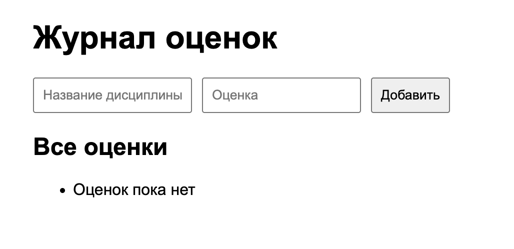
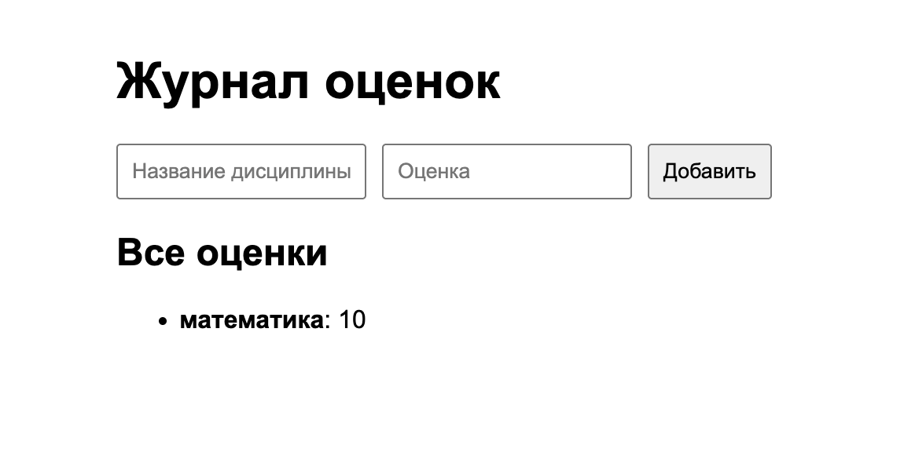
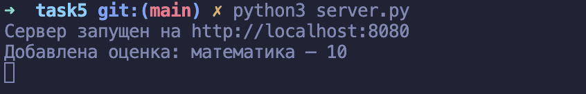

!!! warning "Хранение данных"
    Оценки хранятся в оперативной памяти. После завершения работы сервера данные удаляются, так как не используется бд

**Результат:** сервер обрабатывает GET и POST запросы, сохраняет оценки в сгруппированном виде и возвращает их в составе HTML страницы.

---

## Вывод

В ходе лабораторной работы были изучены основные принципы клиент-серверного взаимодействия и работы с сокетами в Python. Был реализован обмен сообщениями по UDP, вычисление на сервере через TCP, передача HTML страницы по HTTP, многопользовательский чат с потоками и веб-сервер для обработки GET и POST запросов.

В результате работы были получены навыки создания UDP и TCP сокетов, установки соединения, передачи и приёма данных, обработки нескольких клиентов с помощью потоков, формирования HTTP ответов и ручного разбора HTTP запросов.
